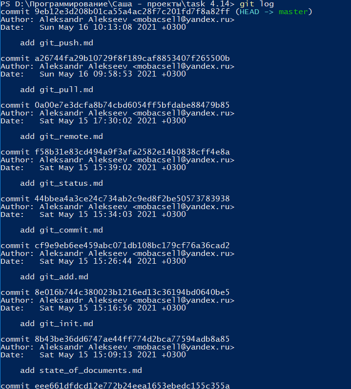

## Команда git log

***git log*** - данная команда показывает список последних коммитов, начиная с конца.

Для выполнения команды необходимо в командной строке в соответствующем каталоге набрать одну из следующих команд:

```bash=
git log
```

Ниже приведен пример выполнения команды ***git log***:



[***Вернуться к оглавлению***](../readme.md)