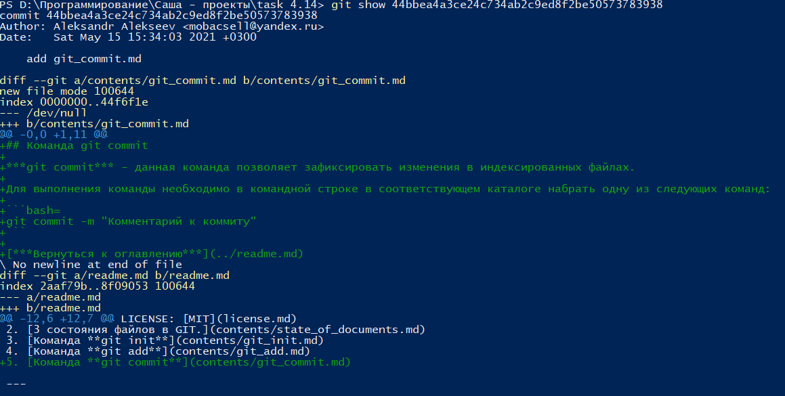

## Команда git show

***git show*** - данная команда показывает изменения, которые были зафиксированы в указанном комимите.

Для выполнения команды необходимо в командной строке в соответствующем каталоге набрать одну из следующих команд:

```bash=
git show [хэш коммита]
```

Ниже приведен пример выполнения команды ***git show***:



[***Вернуться к оглавлению***](../readme.md)