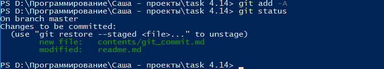

## Команда git status

***git status*** - данная команда отображает список файлов, в которые были внесены изменения (кроме игнорируемых), а также состояние данных файлов.

Для выполнения команды необходимо в командной строке в соответствующем каталоге набрать одну из следующих команд:

```bash=
git status
```

Ниже приведен пример выполнения команды ***git status***:



[***Вернуться к оглавлению***](../readme.md)